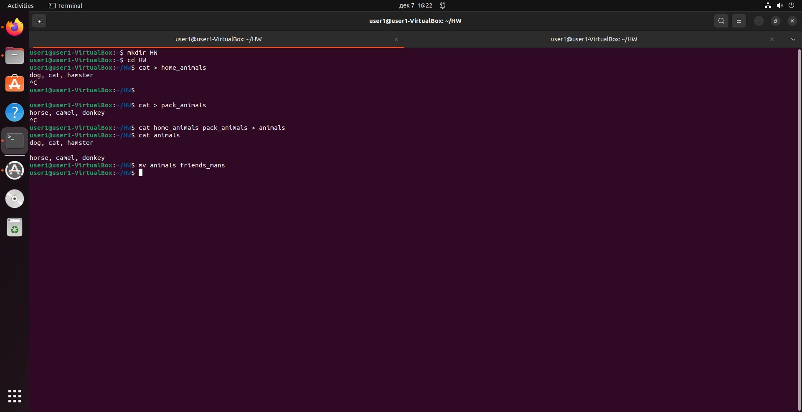
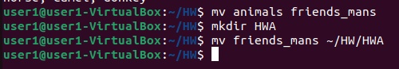
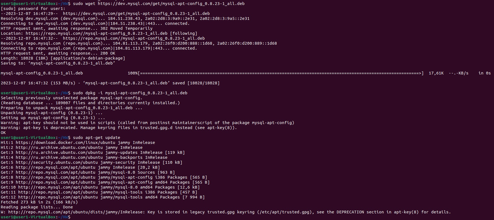
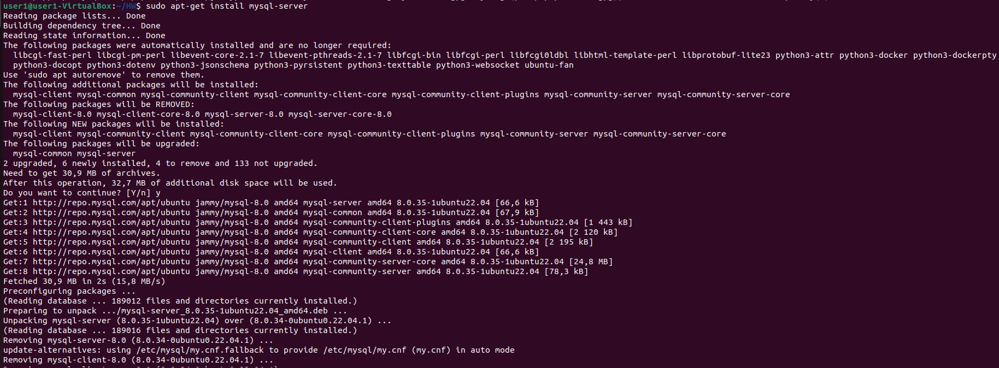
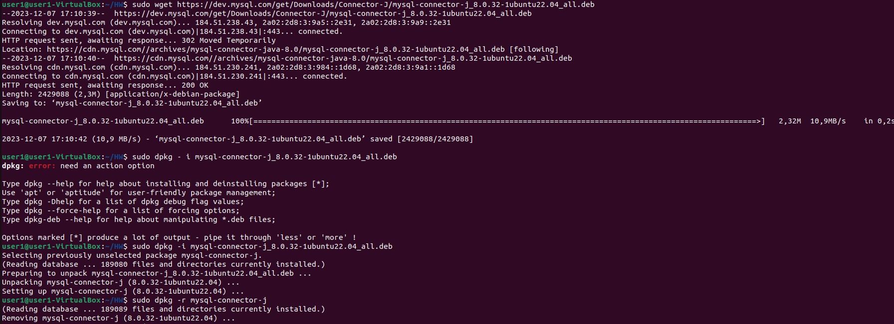
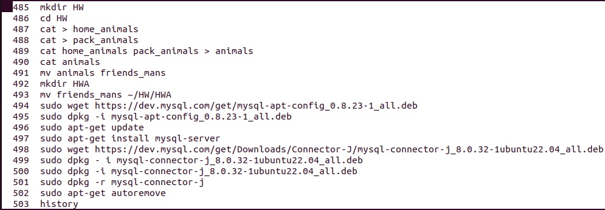
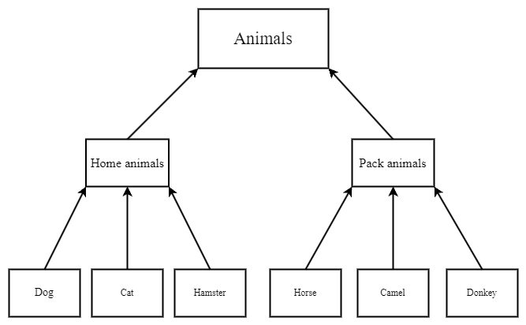

# **Итоговая контрольная работа**
## **Информация о проекте**
**Необходимо организовать систему учета для питомника в котором живут
домашние и вьючные животные.**
## **Задание**

1. **Используя команду cat в терминале операционной системы Linux, создать
два файла Домашние животные (заполнив файл собаками, кошками,
хомяками) и Вьючные животными заполнив файл Лошадьми, верблюдами и
ослы), а затем объединить их. Просмотреть содержимое созданного файла.
Переименовать файл, дав ему новое имя (Друзья человека).**
2. **Создать директорию, переместить файл туда.**
3. **Подключить дополнительный репозиторий MySQL. Установить любой пакет
из этого репозитория.**
4. **Установить и удалить deb-пакет с помощью dpkg.**
5. **Выложить историю команд в терминале ubuntu**
6. **Нарисовать диаграмму, в которой есть класс родительский класс, домашние
животные и вьючные животные, в составы которых в случае домашних
животных войдут классы: собаки, кошки, хомяки, а в класс вьючные животные
войдут: Лошади, верблюды и ослы).**
7. **В подключенном MySQL репозитории создать базу данных “Друзья
человека”**
8. **Создать таблицы с иерархией из диаграммы в БД**
9. **Заполнить низкоуровневые таблицы именами(животных), командами
которые они выполняют и датами рождения**
10. **Удалив из таблицы верблюдов, т.к. верблюдов решили перевезти в другой
питомник на зимовку. Объединить таблицы лошади, и ослы в одну таблицу.**
11. **Создать новую таблицу “молодые животные” в которую попадут все
животные старше 1 года, но младше 3 лет и в отдельном столбце с точностью
до месяца подсчитать возраст животных в новой таблице**
12. **Объединить все таблицы в одну, при этом сохраняя поля, указывающие на
прошлую принадлежность к старым таблицам.**
13. **Создать класс с Инкапсуляцией методов и наследованием по диаграмме.**
14. **Написать программу, имитирующую работу реестра домашних животных.
В программе должен быть реализован следующий функционал:**
- **Завести новое животное**
- **определять животное в правильный класс**
- **увидеть список команд, которое выполняет животное**
- **обучить животное новым командам**
- **Реализовать навигацию по меню**
15. **Создайте класс Счетчик, у которого есть метод add(), увеличивающий̆
значение внутренней̆int переменной̆на 1 при нажатие “Завести новое
животное” Сделайте так, чтобы с объектом такого типа можно было работать в
блоке try-with-resources. Нужно бросить исключение, если работа с объектом
типа счетчик была не в ресурсном try и/или ресурс остался открыт. Значение
считать в ресурсе try, если при заведения животного заполнены все поля.**

## **Сдача проекта**
1. **Используя команду cat в терминале операционной системы Linux, создать
два файла Домашние животные (заполнив файл собаками, кошками,
хомяками) и Вьючные животными заполнив файл Лошадьми, верблюдами и
ослы), а затем объединить их. Просмотреть содержимое созданного файла.
Переименовать файл, дав ему новое имя (Друзья человека).**



2. **Создать директорию, переместить файл туда.**



3. **Подключить дополнительный репозиторий MySQL. Установить любой пакет из этого репозитория.**





4. **Установить и удалить deb-пакет с помощью dpkg.**



5. **Выложить историю команд в терминале ubuntu**



6. **Нарисовать диаграмму, в которой есть класс родительский класс, домашние животные и вьючные животные, в составы которых в случае домашних животных войдут классы: собаки, кошки, хомяки, а в класс вьючные животные войдут: Лошади, верблюды и ослы).**



7. **В подключенном MySQL репозитории создать базу данных “Друзья человека”**

```MySQL0000000000040
CREATE DATABASE friends_mans;
```
8. **Создать таблицы с иерархией из диаграммы в БД**
```MySQL
USE friends_mans;
CREATE TABLE animal_classes
(
	Id INT AUTO_INCREMENT PRIMARY KEY, 
	Class_name VARCHAR(20)
);
CREATE TABLE packed_animals
(
	  Id INT AUTO_INCREMENT PRIMARY KEY,
    Genus_name VARCHAR (20),
    Class_id INT,
    FOREIGN KEY (Class_id) REFERENCES animal_classes (Id) ON DELETE CASCADE ON UPDATE CASCADE
);   
CREATE TABLE home_animals
(
	  Id INT AUTO_INCREMENT PRIMARY KEY,
    Genus_name VARCHAR (20),
    Class_id INT,
    FOREIGN KEY (Class_id) REFERENCES animal_classes (Id) ON DELETE CASCADE ON UPDATE CASCADE
);
CREATE TABLE cats 
(       
    Id INT AUTO_INCREMENT PRIMARY KEY, 
    Name VARCHAR(20), 
    Birthday DATE,
    Commands VARCHAR(50),
    Genus_id int,
    Foreign KEY (Genus_id) REFERENCES home_animals (Id) ON DELETE CASCADE ON UPDATE CASCADE
);
CREATE TABLE dogs 
(       
    Id INT AUTO_INCREMENT PRIMARY KEY, 
    Name VARCHAR(20), 
    Birthday DATE,
    Commands VARCHAR(50),
    Genus_id int,
    Foreign KEY (Genus_id) REFERENCES home_animals (Id) ON DELETE CASCADE ON UPDATE CASCADE
);
CREATE TABLE hamsters 
(       
    Id INT AUTO_INCREMENT PRIMARY KEY, 
    Name VARCHAR(20), 
    Birthday DATE,
    Commands VARCHAR(50),
    Genus_id int,
    Foreign KEY (Genus_id) REFERENCES home_animals (Id) ON DELETE CASCADE ON UPDATE CASCADE
);
CREATE TABLE horses 
(       
    Id INT AUTO_INCREMENT PRIMARY KEY, 
    Name VARCHAR(20), 
    Birthday DATE,
    Commands VARCHAR(50),
    Genus_id int,
    Foreign KEY (Genus_id) REFERENCES packed_animals (Id) ON DELETE CASCADE ON UPDATE CASCADE
);
CREATE TABLE donkeys 
(       
    Id INT AUTO_INCREMENT PRIMARY KEY, 
    Name VARCHAR(20), 
    Birthday DATE,
    Commands VARCHAR(50),
    Genus_id int,
    Foreign KEY (Genus_id) REFERENCES packed_animals (Id) ON DELETE CASCADE ON UPDATE CASCADE
);
CREATE TABLE camels 
(       
    Id INT AUTO_INCREMENT PRIMARY KEY, 
    Name VARCHAR(20), 
    Birthday DATE,
    Commands VARCHAR(50),
    Genus_id int,
    Foreign KEY (Genus_id) REFERENCES packed_animals (Id) ON DELETE CASCADE ON UPDATE CASCADE
);

```
9. **Заполнить низкоуровневые таблицы именами(животных), командами которые они выполняют и датами рождения**
```MySQL
INSERT INTO animal_classes (Class_name)
VALUES ('packs'),
('homes');  

INSERT INTO packed_animals (Genus_name, Class_id)
VALUES ('horses', 1),
('donkeys', 1),  
('camels', 1); 

INSERT INTO home_animals (Genus_name, Class_id)
VALUES ('cats', 2),
('dogs', 2),  
('hamsters', 2); 

INSERT INTO cats (Name, Birthday, Commands, Genus_id)
VALUES ('Пупа', '2011-01-01', 'кс-кс-кс', 1),
('Олег', '2016-01-01', "отставить!", 1),  
('Тьма', '2017-01-01', "", 1); 

INSERT INTO dogs (Name, Birthday, Commands, Genus_id)
VALUES ('Дик', '2020-01-01', 'ко мне, лежать, лапу, голос', 2),
('Граф', '2021-06-12', "сидеть, лежать, лапу", 2),  
('Шарик', '2018-05-01', "сидеть, лежать, лапу, след, фас", 2), 
('Босс', '2021-05-10', "сидеть, лежать, фу, место", 2);

INSERT INTO hamsters (Name, Birthday, Commands, Genus_id)
VALUES ('Малой', '2020-10-12', '', 3),
('Медведь', '2021-03-12', "атака сверху", 3),  
('Ниндзя', '2022-07-11', NULL, 3), 
('Бурый', '2022-05-10', NULL, 3);

INSERT INTO horses (Name, Birthday, Commands, Genus_id)
VALUES ('Гром', '2020-01-12', 'бегом, шагом', 1),
('Закат', '2017-03-12', "бегом, шагом, хоп", 1),  
('Байкал', '2016-07-12', "бегом, шагом, хоп, брр", 1), 
('Молния', '2020-11-10', "бегом, шагом, хоп", 1);

INSERT INTO donkeys (Name, Birthday, Commands, Genus_id)
VALUES ('Первый', '2019-04-10', NULL, 2),
('Второй', '2020-03-12', "", 2),  
('Третий', '2021-07-12', "", 2), 
('Четвертый', '2022-12-10', NULL, 2);

INSERT INTO camels (Name, Birthday, Commands, Genus_id)
VALUES ('Горбатый', '2022-04-10', 'вернись', 3),
('Самец', '2019-03-12', "остановись", 3),  
('Сифон', '2015-07-12', "повернись", 3), 
('Борода', '2022-12-10', "улыбнись", 3);
```
10. **Удалив из таблицы верблюдов, т.к. верблюдов решили перевезти в другой питомник на зимовку. Объединить таблицы лошади, и ослы в одну таблицу.**

```MySQL
SET SQL_SAFE_UPDATES = 0;
DELETE FROM camels;

SELECT Name, Birthday, Commands FROM horses
UNION SELECT  Name, Birthday, Commands FROM donkeys;
```

11. **Создать новую таблицу “молодые животные” в которую попадут все животные старше 1 года, но младше 3 лет и в отдельном столбце с точностью до месяца подсчитать возраст животных в новой таблице**

```MySQL
CREATE TABLE yang_animal AS
SELECT Name, Birthday, Commands, genus, TIMESTAMPDIFF(MONTH, Birthday, CURDATE()) AS Age_in_month
FROM animals WHERE Birthday BETWEEN ADDDATE(curdate(), INTERVAL -3 YEAR) AND ADDDATE(CURDATE(), INTERVAL -1 YEAR);
 
SELECT * FROM yang_animal;
```

12.  **Объединить все таблицы в одну, при этом сохраняя поля, указывающие на прошлую принадлежность к старым таблицам.**

```MySQL
SELECT h.Name, h.Birthday, h.Commands, pa.Genus_name, ya.Age_in_month 
FROM horses h
LEFT JOIN yang_animal ya ON ya.Name = h.Name
LEFT JOIN packed_animals pa ON pa.Id = h.Genus_id
UNION 
SELECT d.Name, d.Birthday, d.Commands, pa.Genus_name, ya.Age_in_month 
FROM donkeys d 
LEFT JOIN yang_animal ya ON ya.Name = d.Name
LEFT JOIN packed_animals pa ON pa.Id = d.Genus_id
UNION
SELECT c.Name, c.Birthday, c.Commands, ha.Genus_name, ya.Age_in_month 
FROM cats c
LEFT JOIN yang_animal ya ON ya.Name = c.Name
LEFT JOIN home_animals ha ON ha.Id = c.Genus_id
UNION
SELECT d.Name, d.Birthday, d.Commands, ha.Genus_name, ya.Age_in_month 
FROM dogs d
LEFT JOIN yang_animal ya ON ya.Name = d.Name
LEFT JOIN home_animals ha ON ha.Id = d.Genus_id
UNION
SELECT hm.Name, hm.Birthday, hm.Commands, ha.Genus_name, ya.Age_in_month 
FROM hamsters hm
LEFT JOIN yang_animal ya ON ya.Name = hm.Name
LEFT JOIN home_animals ha ON ha.Id = hm.Genus_id;
```
13. Создать класс с Инкапсуляцией методов и наследованием по диаграмме.


